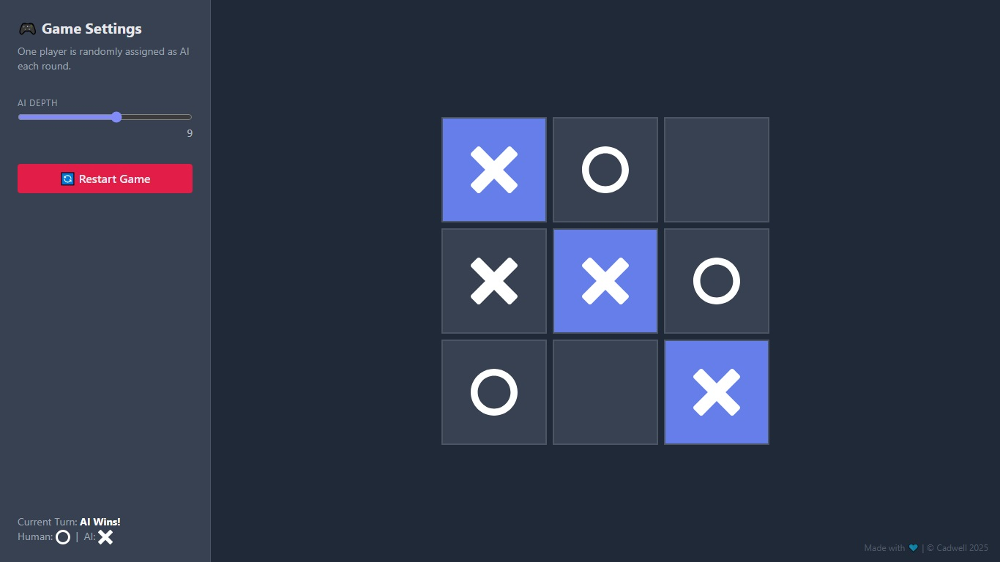
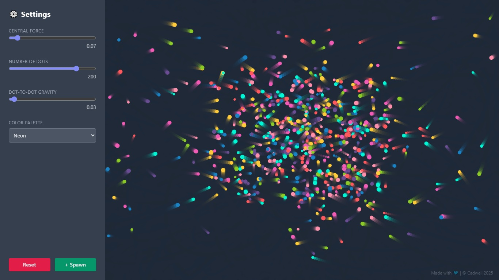

# Code-Sandboxed 🧪

**A digital sandbox where code comes to play.**  
This repo is home to a collection of micro-games and digital crafts that are just as fun to make as they are to play — built for amusement, exploration, and the occasional "aha!" moment in the browser.

---

## 🧩 Projects

### 🎯 TicTacThink
A smart twist on the classic Tic-Tac-Toe game, powered by the Minimax algorithm. It’s quick, clever, and impossible to beat (unless you’re perfect).

🔗 [Open TicTacThink](./TicTacThink)

---

### 🌈 GraviDots
Colorful dots, smooth gravity, and playful interactions built with Tailwind CSS. A satisfying visual experiment where dots fall, float, and bounce in harmony.

🔗 [Open GraviDots](./GraviDots)

---

## 🛠 Tech Stack
- HTML CSS
- Tailwind
- JavaScript

---

## 🚀 More to Come
This sandbox is always expanding — stay tuned for more experimental games, interactive toys, and other creative coding doodles.

---

## 📄 License
[MIT License](./LICENSE)
